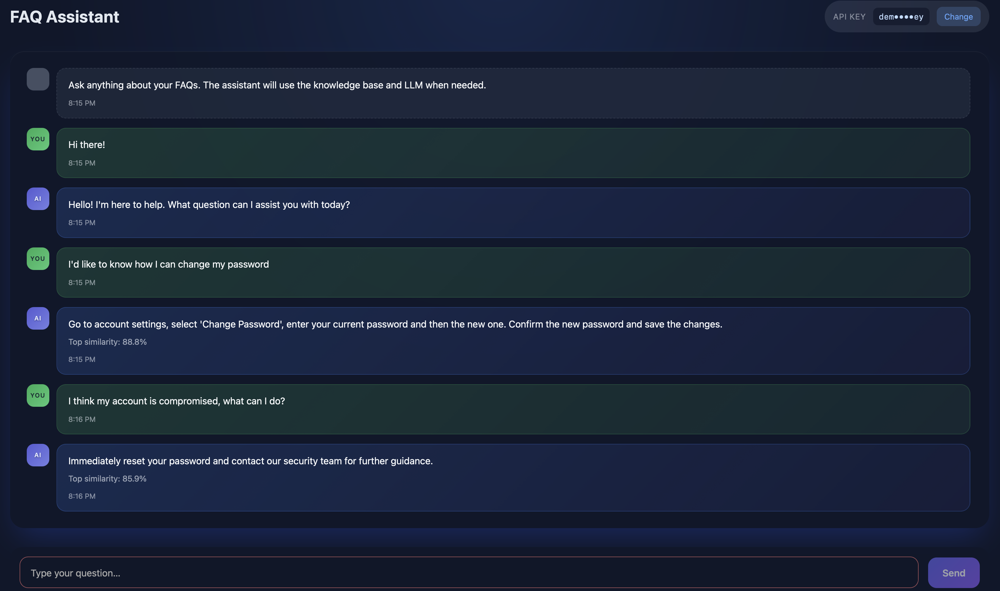

# FAQ RAG Assistant

A full-stack FAQ management system with RAG & LLM.



## Architecture

- **Frontend**: Angular 18 (`/frontend`)
- **Backend**: Python FastAPI with PostgreSQL + pgvector (`/backend`)

## Prerequisites

- Node.js 20+ and npm 10+ (for local UI development)
- Python 3.11+
- Docker and Docker Compose

## Documentation

- [Backend Documentation](backend/README.md) - Detailed FastAPI setup and API docs
- [Frontend Documentation](frontend/README.md) - Angular development guide

## Quick Start

### 1. Clone the Repository
```bash
git clone https://github.com/danielllungu/rag_faq_assistant.git
cd rag_faq_assistant
```

### 2. Set Up Backend
```bash
cd backend
```

Create `.env` file with required variables (see [backend/README.md](backend/README.md))

Start PostgreSQL:
```bash
docker-compose up -d
```

Install dependencies:
```bash
pip install -r requirements.txt
```

Initialize database:
```bash
python db_init/initialize.py
python db_init/scripts/seed_database.py
```

Run the API:
```bash
docker build -t faq-rag-app -f Dockerfile .

docker run --rm --name faq-app -p 8000:8000 --env-file ./.env -e DB_HOST=host.docker.internal faq-rag-app
```

API available at: `http://localhost:8000`

### 3. Set Up Frontend (two options, see full documentation [frontend/README.md](frontend/README.md))
```bash
cd ../frontend
```

Install dependencies:
```bash
npm install
```

Run development server:
```bash
npm start
```

Frontend available at: `http://localhost:4200`
